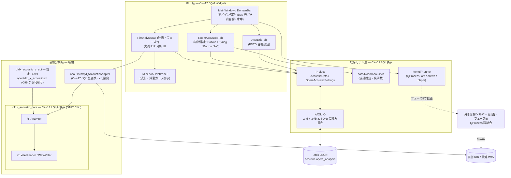
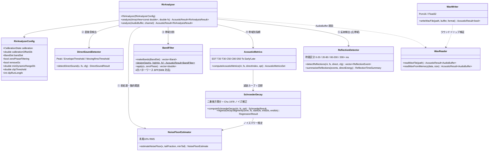
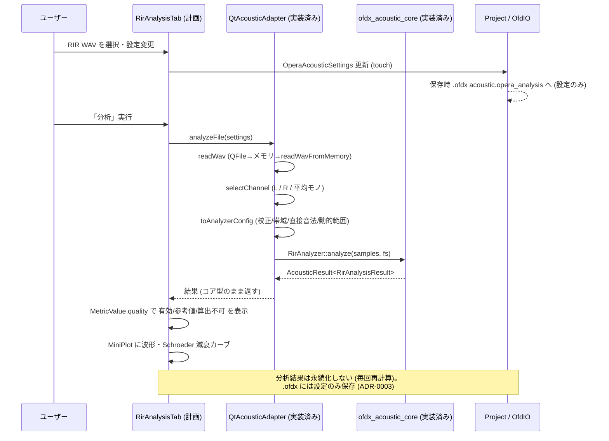
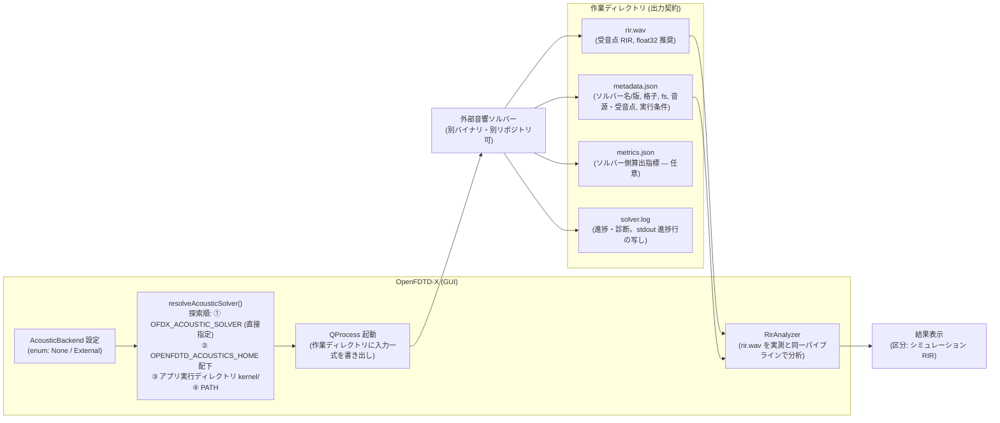

# オペラ歌手向け室内音響分析 — アーキテクチャ設計

対象: OpenFDTD-X (branch `claude/opera-acoustics`)。
本書は実装済みコード (`src/acoustics/**`, `CMakeLists.txt`) と、フェーズ2
以降の計画部分 (RirAnalysisTab、外部音響ソルバー) の構成を示す。
計画部分は図中で「計画」と明記する。

## 1. 全体構成 (現在の OpenFDTD-X + 音響分析層)

依存規則 (CMake で強制):

- `ofdx_acoustic_core` は **Qt にリンクしない**。`CXX_STANDARD 14` /
  `CXX_STANDARD_REQUIRED ON` / `CXX_EXTENSIONS OFF` (逸脱はビルドエラー)。
- `ofdx_acoustic_c_api` はコアのみに依存 (同じく C++14 固定)。ヘッダは
  純 C (C99) から include 可能で、`tests/acoustics/test_c_api.c` が
  C コンパイラでのビルド可否そのものを検証する。
- Qt 型 (`QString` 等) がコアに入る唯一の入口は `QtAcousticAdapter`。

## 2. C++14 コアのクラス構成 (実装済み)

処理順 (`RirAnalyzer::analyze`):
前処理 (入力長 → 非有限値 → クリッピング → DC 除去 → 動的範囲) →
直接音検出 → 絶対 SPL (校正時のみ) → 帯域分割 → 帯域別
Schroeder/ISO 3382-1 指標 → 反射検出・時間区分集計 → 総合品質判定。
共通の結果表現は `MetricValue` (値 + valid + AnalysisQuality + warning) と
`AcousticResult<T>` (エラーコード 16 値、例外なし)。

## 3. 分析結果フロー (フェーズ2: GUI 統合)

- 結果のライフサイクル: `RirAnalysisResult` はメモリ上のみ。`.ofdx` には
  設定 (`opera_analysis` キー群) だけを保存する。大容量データ (WAV) は
  パス参照 (`docs/opera-acoustics-file-format.md`)。
- 統計推定 (RoomAcousticsTab) / 実測 RIR / シミュレーション RIR の 3 区分
  を UI で明示する (要求 §2)。

## 4. 外部音響ソルバー連携 (フェーズ5 — 計画)

既存 `ofd` (電磁 FDTD) は音響に流用しない (ADR-0004)。音響ソルバーは
別バイナリとして QProcess で疎結合に起動する。

出力契約 (ソルバー側の義務):

| ファイル | 必須 | 内容 |
|---|---|---|
| `metadata.json` | 必須 | スキーマ版、ソルバー名/バージョン、格子 (Δx, セル数)、fs、音源/受音点座標、音速、実行時間 |
| `rir.wav` | 必須 | 受音点ごとの RIR (複数受音点は複数チャンネルまたは連番ファイル)。float32 推奨 (WavReader 対応形式であること) |
| `metrics.json` | 任意 | ソルバー側で算出した指標。GUI 側は自前計算 (RirAnalyzer) を正とし、突合表示のみに使う |
| `solver.log` | 必須 | 実行ログ。進捗は stdout にも出力 (Runner が進捗解析) |

環境変数:

- `OPENFDTD_ACOUSTICS_HOME` — 音響ソルバー群のインストール先 (既存
  `OPENFDTD_HOME` / `OPENRCWA_HOME` / `OPENBPM_HOME` と同じ流儀)。
- `OFDX_ACOUSTIC_SOLVER` — ソルバーバイナリの絶対パス直接指定
  (探索順のどれよりも優先。CI・開発時のオーバーライド用)。

`rir.wav` の分析は実測 RIR と完全に同一のコード経路
(`WavReader` → `RirAnalyzer`) を通すため、指標の定義差・実装差が
発生しない — これがフェーズ5 を「ソルバー = RIR 生成器」に限定する
主目的である。

## 5. 二層 C++ 規格 (GUI C++17 / コア C++14) の理由

詳細は `docs/adr/0001-two-tier-cxx-standard.md`。要点:

1. **全体を C++14 にはできない**: Qt6 が C++17 を強制する
   (実測: Qt 6.4.2 `qglobal.h` が `-std=c++14` に対し
   `#error "Qt requires a C++17 compiler"`)。GUI 層は C++17 必須。
2. **コアを C++14 に固定する価値**: 音響コアは外部カーネル
   (フェーズ5 のソルバー側での再利用)・他プロジェクト・古い
   ツールチェーン (CUDA / 組込み / 長期サポートコンパイラ) から
   リンクされ得る。要求規格を下げるほど再利用先が広がる。
3. **機械的強制**: 「C++14 の範囲で書く」だけでは逸脱を検知できない
   (フェーズ0 調査 §7.1)。別 STATIC ライブラリターゲットに分離し
   `CXX_STANDARD 14; CXX_STANDARD_REQUIRED ON; CXX_EXTENSIONS OFF` を
   設定することで、C++17 構文の混入がその場でビルドエラーになる。
4. **接続コスト**: Qt 型との変換は `QtAcousticAdapter` の 1 箇所に集約
   し、コアは `std::vector<double>` / `std::string` / POD のみを使う。
   さらに C ABI (`ofdx_acoustic_c_api`) を被せ、C99 からの利用と
   ABI 前方互換 (`struct_size` / `api_version` 検査) を保証する。
